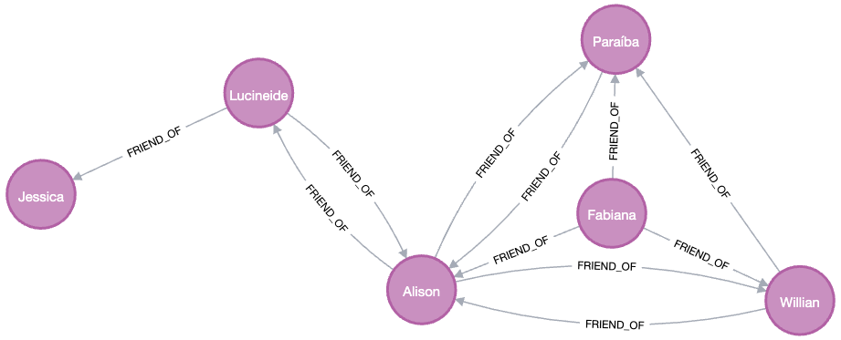

# Rede Social em Python com Neo4j

## Descrição

Este programa é uma aplicação de rede social simples desenvolvida em Python, utilizando o banco de dados Neo4j. O objetivo é demonstrar o uso de um banco de dados de grafos para gerenciar e visualizar relações em uma rede social.

## Funcionalidades

- Adicionar uma nova pessoa com nome, idade e localização.
- Listar todas as pessoas cadastradas.
- Estabelecer relações de amizade entre pessoas.
- Visualizar a rede de amizades de uma pessoa específica.
- Remover uma pessoa da rede social.

## Instalação

1. Certifique-se de ter Python instalado em seu sistema.
2. Instale a biblioteca neo4j para Python:

   pip install neo4j

3. Clone este repositório para sua máquina local.
4. Certifique-se de que o Neo4j está rodando (localmente ou em um container Docker).

## Uso

Para iniciar o programa, navegue até a pasta do projeto e execute o script Python:

python main.py

